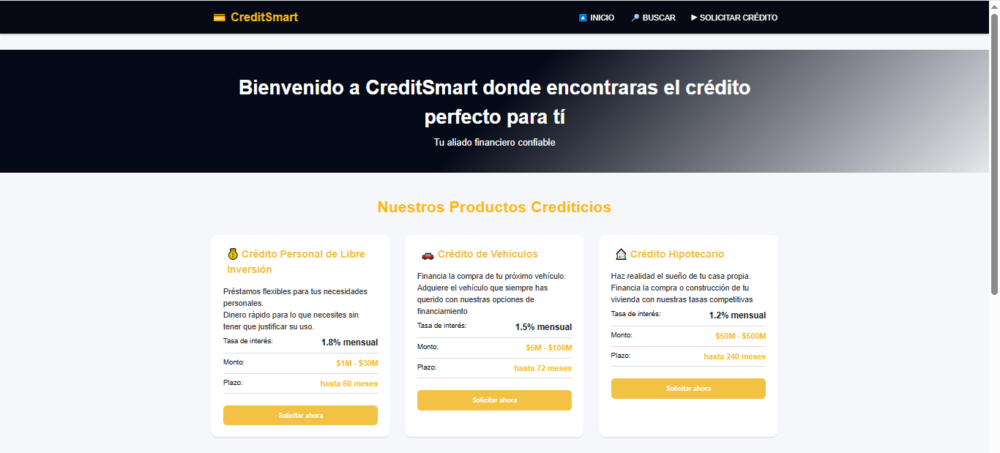
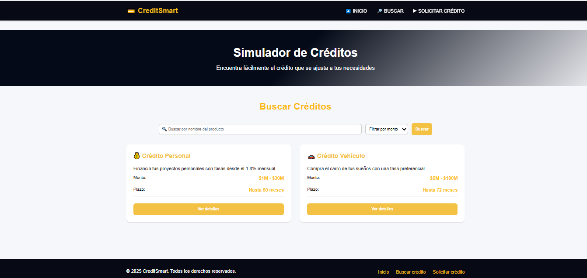
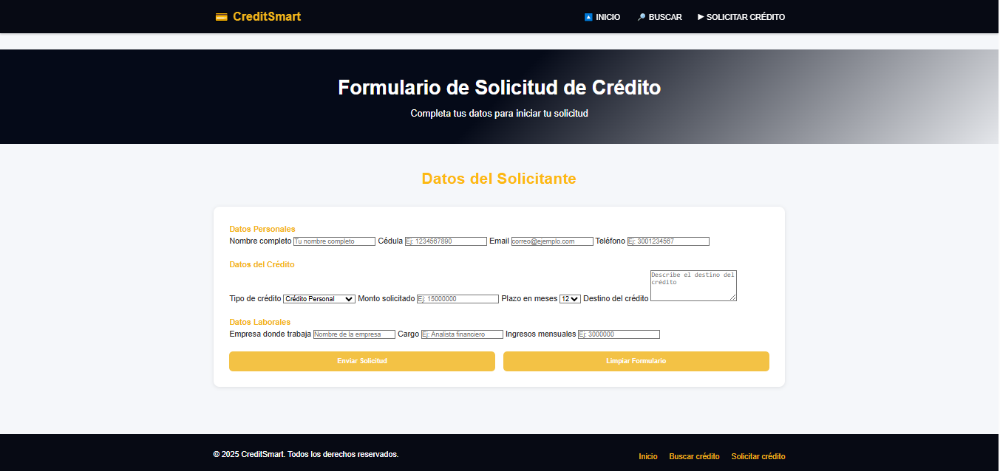

# 💳 CreditSmart - Sistema de Gestión de Créditos

## 👨‍💻 Desarrollado por:
**Kéneth Anderson Dávila Cuesta**
**Isai Manuel Narvaez Redondo**
---

## 🧠 Descripción del Proyecto
**CreditSmart** es una plataforma web diseñada como ejercicio académico de Ingeniería Web I, que permite a los usuarios **consultar, simular y solicitar créditos en línea**.  
El proyecto aplica buenas prácticas de **HTML5 semántico**, **CSS3 profesional** y **diseño responsive**, garantizando una experiencia clara y moderna en dispositivos **desktop, tablet y móvil**.

---

## 🗂️ Estructura del Proyecto
/CreditSmart
│
├── index.html → Página principal (Catálogo de Créditos)
├── simulador.html → Simulador de Créditos (Búsqueda visual)
├── solicitar.html → Formulario de Solicitud de Crédito
│
├── css/
│ └── style.css → Archivo principal de estilos
│
└── README.md → Documentación del proyecto

